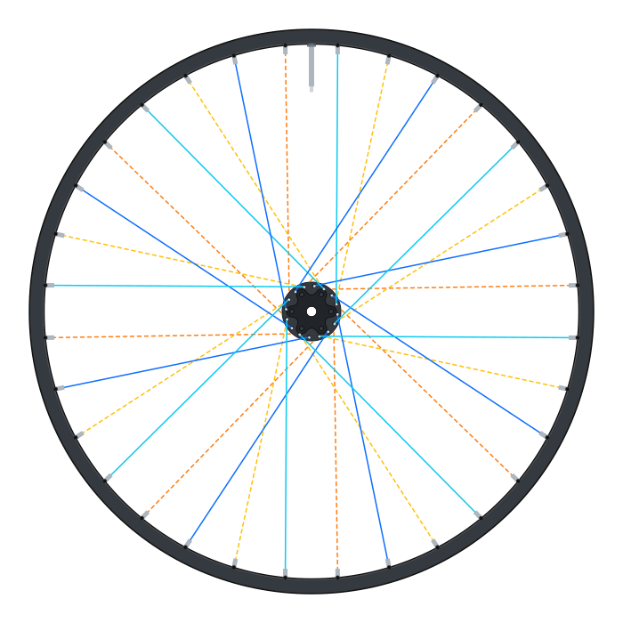
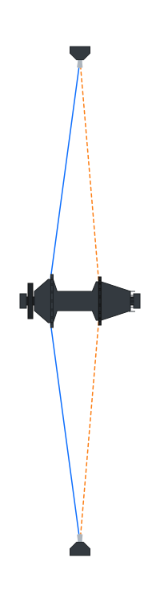
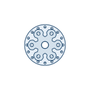

# SVG Bicycle Wheel Generator

Generate pure SVG strings for bicycle wheel, hub, spoke-lacing, rim, brake mount,
valve, and side-profile previews. The runtime is DOM-free JavaScript math, so it
works in Node.js, browsers, bundlers, server renderers, edge runtimes, and script
tags.

This package ports the standalone `Wheel Genorator.html` visualizer into the
same library structure as `svg-bicycle-drivetrain-generator`.

## Install

```bash
npm install svg-bicycle-wheel-generator
```

You can also install from GitHub:

```bash
npm install github:ilslaoaycd/svg-bicycle-wheel-generator
```

## Quick Start

```js
import {
  BicycleWheelSVG,
  renderHubSideSvg,
  renderWheelFaceSvg
} from 'svg-bicycle-wheel-generator';

const wheel = renderWheelFaceSvg({
  view: { wheelFaceSide: 'right' },
  wheel: {
    outerDia: 634,
    erd: 601,
    rimWidth: 25,
    spokeCount: 32,
    valveType: 'presta'
  },
  hub: {
    hubPosition: 'rear',
    brakeType: '6bolt',
    hubType: 'jbend',
    leftFlangeDia: 58,
    rightFlangeDia: 52,
    leftFlangeCenter: 36.6,
    rightFlangeCenter: 23.3
  },
  lacing: { crossPattern: 3 },
  style: {
    spokeLayering: '3d',
    spokeColor: 'color',
    nippleStyle: 'nipples',
    nippleColor: 'silver',
    theme: 'drawing',
    paintMode: 'hybrid'
  }
});

const generator = new BicycleWheelSVG();
const side = generator.wheelSide();
const hub = renderHubSideSvg();
```

## API

### Facade

```js
const generator = new BicycleWheelSVG(config);

generator.wheel(options);
generator.wheelFace(options);
generator.wheelSide(options);
generator.hubFace(options);
generator.hubSide(options);
generator.spokeBuild(options);
```

### Convenience Functions

```js
renderWheelSvg(options);
renderWheelFaceSvg(options);
renderWheelSideSvg(options);
renderHubFaceSvg(options);
renderHubSideSvg(options);
```

### Lower-Level Exports

The package also exports `WheelFaceSVGGenerator`, `WheelSideSVGGenerator`,
`HubSVGGenerator`, `calculateSpokeLength`, `calculateWheelBuild`,
`rimHolePositions`, `hubHolePositions`, `lacingMap`, `normalizeOptions`,
`validateWheelBuild`, `STYLE_PRESETS`, `defineStylePreset`, and
`resolveStyleOptions`.

## Options

Options may be passed in nested groups, or as the flat state names used by the
original HTML visualizer.

```js
renderWheelFaceSvg({
  wheel: {
    outerDia: 634,
    erd: 601,
    rimWidth: 25,
    rimOffset: 0,
    spokeCount: 32,
    valveType: 'presta' // "presta", "schrader", or "marker"
  },
  hub: {
    preset: 'dt-swiss-350-mtb-boost-rear-6bolt',
    hubPosition: 'rear', // "front" or "rear"
    brakeType: '6bolt', // "rim", "6bolt", or "centerlock"
    hubType: 'jbend', // "jbend" or "straightpull"
    builtInDimension: 148,
    showHubHoles: 'visible',
    leftFlangeDia: 58,
    rightFlangeDia: 52,
    leftFlangeCenter: 36.6,
    rightFlangeCenter: 23.3
  },
  lacing: {
    crossPattern: 3
  },
  view: {
    wheelFaceSide: 'left',
    hubFaceSide: 'left'
  },
  style: {
    spokeLayering: '3d', // "3d" or "flat"
    spokeColor: 'color', // "color", "black", or "silver"
    nippleStyle: 'nipples', // "nipples", "dots", or "none"
    nippleColor: 'silver',
    theme: 'drawing', // "drawing", "technical", "realistic", or "light"
    hubRenderStyle: 'blueprint', // optional override: "blueprint" or "realistic"
    paintMode: 'hybrid', // "hybrid", "css", or "inline"
    palette: {
      hubShellFill: '#eaf1f8',
      hubShellStroke: '#1f4b72',
      spokeLeftPulling: '#0d6efd'
    }
  }
});
```

Hub presets are optional and merge before explicit hub options, so a preset can
provide a real hub starting point while local dimensions override it. Current
hub geometry presets are:

```js
hub: { preset: 'dt-swiss-350-mtb-boost-rear-6bolt' }
hub: { preset: 'dt-swiss-240-exp-boost-rear-centerlock' }
hub: { preset: 'industry-nine-hydra2-boost-rear-6bolt' }
hub: { preset: 'industry-nine-solix-road-rear-centerlock' }
```

## Styling

Generated SVGs are self-contained, but the paint system is tokenized for host
applications. Built-in style presets live in `STYLE_PRESETS` and are selected
with `style.theme`. Presets can set colors and rendering behavior such as spoke
colors, nipple indicators, valve type, hub hole visibility, and hub render mode.
The built-in style presets are:

| Preset | Best for | Built-in behavior |
| --- | --- | --- |
| `drawing` | clean technical drawings on white backgrounds | Black strokes, white fills, black spokes, real nipples hidden under the rim, no hub spoke-hole dots, hollow side rim, light technical wheel-face rim, and a white presta valve. |
| `technical` | inspecting spoke side/type relationships | Colored spokes by side, patterned leading/trailing spokes, rim dots instead of nipples, visible hub holes, lightly colored flanges by side, white component fills, and a black rim. |
| `realistic` | neutral product-style previews | Greys and blacks, black spokes/rim/nipples hidden under the rim, no extra connection indicators, and a dark presta valve. |
| `light` | dark or black host backgrounds | A light-on-dark version of realistic with light rim, hub, spoke, nipple, and valve colors. |

Use a preset directly with `style.theme`:

```js
const svg = renderWheelFaceSvg({
  style: { theme: 'technical' }
});
```

The SVG CSS and most inline hub paint use CSS custom properties with fallbacks,
so app CSS can override colors without rewriting SVG markup:

```css
.wheel-preview {
  --wheel-rim-face-fill: #111827;
  --wheel-rim-side-fill: #ffffff;
  --wheel-hub-shell-fill: #f8fafc;
  --wheel-hub-shell-stroke: #1e3a8a;
  --wheel-spoke-left-pulling: #06b6d4;
  --wheel-spoke-right-pulling: #f97316;
}
```

`style.paintMode` controls how much paint is emitted on elements:

- `hybrid` emits `var(--token, fallback)` inline attributes for portable SVGs
  that remain app-themeable.
- `css` emits classes and stylesheet rules only, which is easiest to override
  from a host app.
- `inline` emits resolved color values, useful for export pipelines that do not
  support CSS variables.

You can also define local presets by extending an existing one:

```js
import { defineStylePreset } from 'svg-bicycle-wheel-generator';

const shopTheme = defineStylePreset('shop-theme', {
  extends: 'drawing',
  palette: {
    hubShellFill: '#eef2ff',
    hubShellStroke: '#3730a3',
    spokeLeftPulling: '#0891b2'
  }
});
```

For visual tuning, run the local browser tools and open the style gallery:

```bash
npm run build
npm run hub:tuner
```

Then visit `http://localhost:4173/examples/browser/style-gallery.html`.
The gallery renders every preset across hub side, hub faces, wheel faces, and
wheel side views at once. Each preset panel has independent color controls and
an export button for copying tuned preset values back into the library defaults.

## Examples

Run:

```bash
npm run examples
```

Generated SVG examples are written to `examples/svg`.

The checked-in SVG examples are regenerated by `npm run examples` and are kept
in sync with the current preset/rendering defaults.

### Wheel Views

| View | Preview | Files |
| --- | --- | --- |
| Rear wheel, left/non-drive face |  | [SVG](examples/svg/wheel-rear-left-3x.svg) |
| Rear wheel, drive-side face |  | [SVG](examples/svg/wheel-rear-drive-hg.svg) |
| Front straight-pull wheel face |  | [SVG](examples/svg/wheel-front-straightpull.svg) |
| Wheel side projection |  | [SVG](examples/svg/wheel-side-projection.svg) |
| Wheel side cross-section |  | [SVG](examples/svg/wheel-side-cross-section.svg) |

### Hub Views

| View | Preview | Files |
| --- | --- | --- |
| DT Swiss 350 Boost 6-bolt, side |  | [SVG](examples/svg/hub-dt-swiss-350-mtb-boost-rear-6bolt-realistic-side.svg) |
| DT Swiss 350 Boost 6-bolt, left face |  | [SVG](examples/svg/hub-dt-swiss-350-mtb-boost-rear-6bolt-realistic-face-left.svg) |
| DT Swiss 350 Boost 6-bolt, right face |  | [SVG](examples/svg/hub-dt-swiss-350-mtb-boost-rear-6bolt-realistic-face-right.svg) |
| DT Swiss 240 EXP centerlock, side |  | [SVG](examples/svg/hub-dt-swiss-240-exp-boost-rear-centerlock-realistic-side.svg) |
| Industry Nine Hydra2 6-bolt, side |  | [SVG](examples/svg/hub-industry-nine-hydra2-boost-rear-6bolt-realistic-side.svg) |
| Industry Nine Solix centerlock, right face |  | [SVG](examples/svg/hub-industry-nine-solix-road-rear-centerlock-realistic-face-right.svg) |

For the full hub realism notes and source links, see
[examples/hub-comparison.md](examples/hub-comparison.md).

## Development

```bash
npm install
npm test
```
