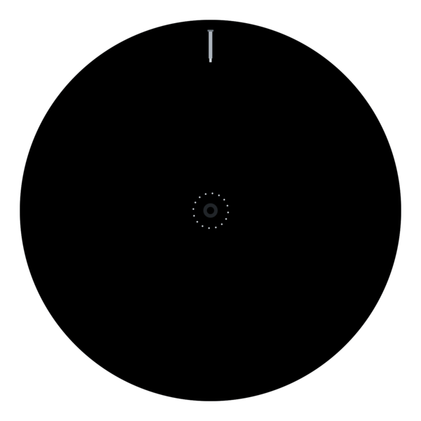
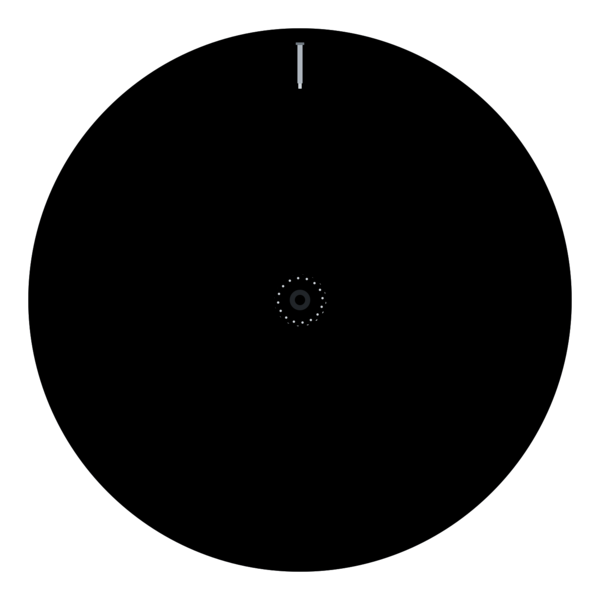
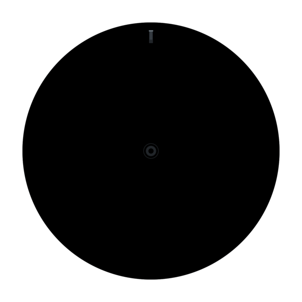
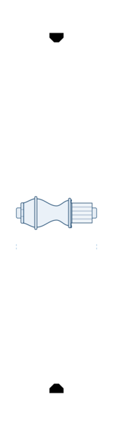
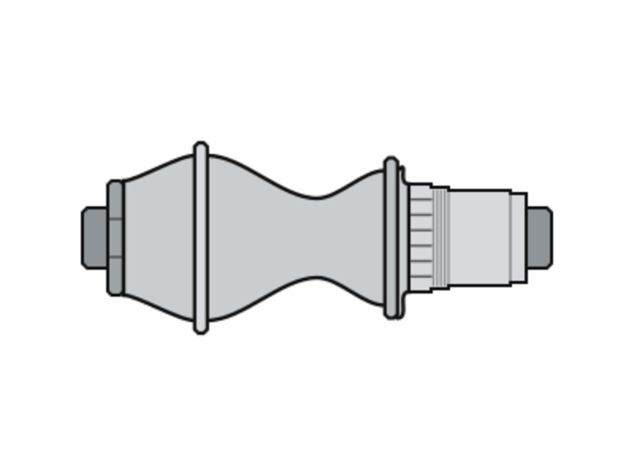
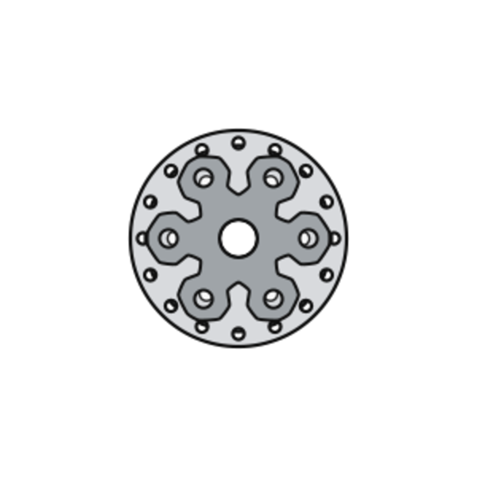
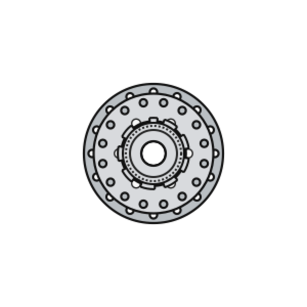
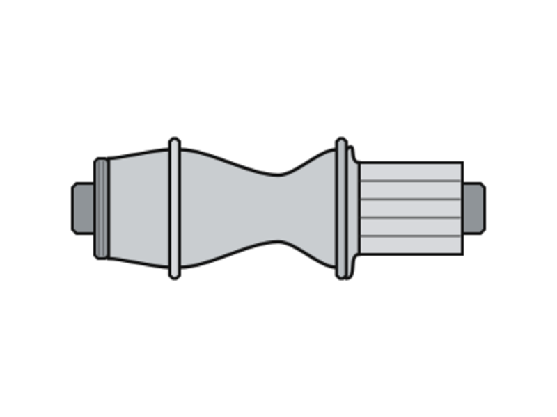
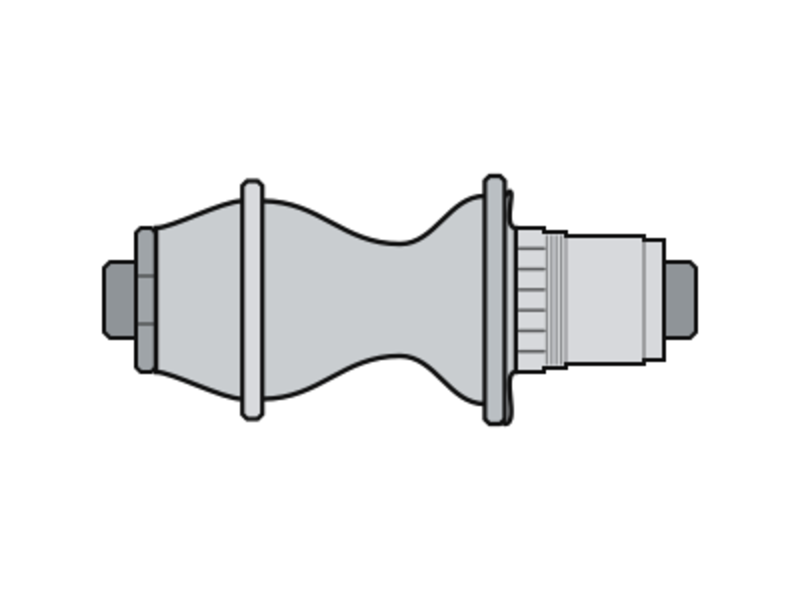
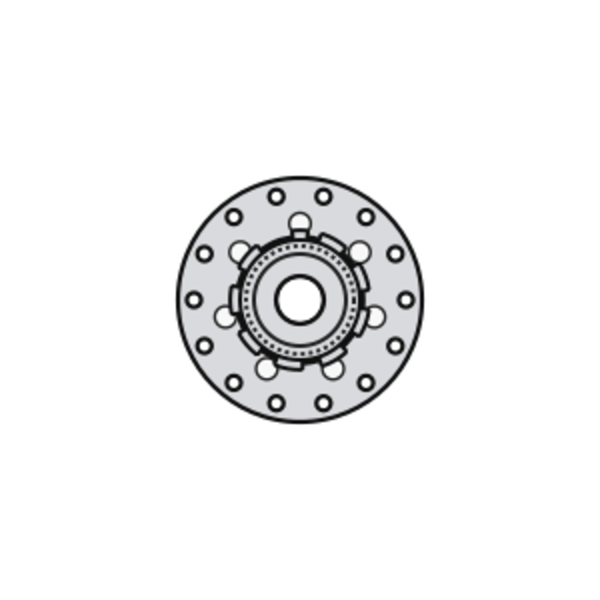

# SVG Bicycle Wheel Generator

Generate pure SVG strings for bicycle wheel, hub, spoke-lacing, rim, brake mount,
valve, and side-profile previews. The runtime is DOM-free JavaScript math, so it
works in Node.js, browsers, bundlers, server renderers, edge runtimes, and script
tags.

This package ports the standalone `Wheel Genorator.html` visualizer into the
same library structure as `svg-bicycle-drivetrain-generator`.

## Install

```bash
npm install svg-bicycle-wheel-generator
```

You can also install from GitHub:

```bash
npm install github:ilslaoaycd/svg-bicycle-wheel-generator
```

## Quick Start

```js
import {
  BicycleWheelSVG,
  renderHubSideSvg,
  renderWheelFaceSvg
} from 'svg-bicycle-wheel-generator';

const wheel = renderWheelFaceSvg({
  view: { wheelFaceSide: 'right' },
  wheel: {
    outerDia: 634,
    erd: 601,
    rimWidth: 25,
    spokeCount: 32,
    valveType: 'presta'
  },
  hub: {
    hubPosition: 'rear',
    brakeType: '6bolt',
    hubType: 'jbend',
    leftFlangeDia: 58,
    rightFlangeDia: 52,
    leftFlangeCenter: 36.6,
    rightFlangeCenter: 23.3
  },
  lacing: { crossPattern: 3 },
  style: {
    spokeLayering: '3d',
    spokeColor: 'color',
    nippleStyle: 'nipples',
    nippleColor: 'silver'
  }
});

const generator = new BicycleWheelSVG();
const side = generator.wheelSide();
const hub = renderHubSideSvg();
```

## API

### Facade

```js
const generator = new BicycleWheelSVG(config);

generator.wheel(options);
generator.wheelFace(options);
generator.wheelSide(options);
generator.hubFace(options);
generator.hubSide(options);
generator.spokeBuild(options);
```

### Convenience Functions

```js
renderWheelSvg(options);
renderWheelFaceSvg(options);
renderWheelSideSvg(options);
renderHubFaceSvg(options);
renderHubSideSvg(options);
```

### Lower-Level Exports

The package also exports `WheelFaceSVGGenerator`, `WheelSideSVGGenerator`,
`HubSVGGenerator`, `calculateSpokeLength`, `calculateWheelBuild`,
`rimHolePositions`, `hubHolePositions`, `lacingMap`, `normalizeOptions`, and
`validateWheelBuild`.

## Options

Options may be passed in nested groups, or as the flat state names used by the
original HTML visualizer.

```js
renderWheelFaceSvg({
  wheel: {
    outerDia: 634,
    erd: 601,
    rimWidth: 25,
    rimOffset: 0,
    spokeCount: 32,
    valveType: 'presta' // "presta", "schrader", or "marker"
  },
  hub: {
    preset: 'dt-swiss-350-mtb-boost-rear-6bolt',
    hubPosition: 'rear', // "front" or "rear"
    brakeType: '6bolt', // "rim", "6bolt", or "centerlock"
    hubType: 'jbend', // "jbend" or "straightpull"
    builtInDimension: 148,
    showHubHoles: 'visible',
    leftFlangeDia: 58,
    rightFlangeDia: 52,
    leftFlangeCenter: 36.6,
    rightFlangeCenter: 23.3
  },
  lacing: {
    crossPattern: 3
  },
  view: {
    wheelFaceSide: 'left',
    hubFaceSide: 'left'
  },
  style: {
    spokeLayering: '3d', // "3d" or "flat"
    spokeColor: 'color', // "color", "black", or "silver"
    nippleStyle: 'nipples',
    nippleColor: 'silver',
    hubRenderStyle: 'blueprint' // "blueprint" or "realistic"
  }
});
```

Hub presets are optional and merge before explicit hub options, so a preset can
provide a real hub starting point while local dimensions override it. Current
blueprint-realism presets are:

```js
hub: { preset: 'dt-swiss-350-mtb-boost-rear-6bolt' }
hub: { preset: 'dt-swiss-240-exp-boost-rear-centerlock' }
hub: { preset: 'industry-nine-hydra2-boost-rear-6bolt' }
hub: { preset: 'industry-nine-solix-road-rear-centerlock' }
```

## Examples

Run:

```bash
npm run examples
```

Generated SVG examples are written to `examples/svg`; PNG previews are written
to `examples/png`.

### Wheel Views

| View | Preview | Files |
| --- | --- | --- |
| Rear wheel, left/non-drive face |  | [SVG](examples/svg/wheel-rear-left-3x.svg) / [PNG](examples/png/wheel-rear-left-3x.png) |
| Rear wheel, drive-side face |  | [SVG](examples/svg/wheel-rear-drive-hg.svg) / [PNG](examples/png/wheel-rear-drive-hg.png) |
| Front straight-pull wheel face |  | [SVG](examples/svg/wheel-front-straightpull.svg) / [PNG](examples/png/wheel-front-straightpull.png) |
| Wheel side projection |  | [SVG](examples/svg/wheel-side-projection.svg) / [PNG](examples/png/wheel-side-projection.png) |
| Wheel side cross-section |  | [SVG](examples/svg/wheel-side-cross-section.svg) / [PNG](examples/png/wheel-side-cross-section.png) |

### Hub Views

| View | Preview | Files |
| --- | --- | --- |
| DT Swiss 350 Boost 6-bolt, side |  | [SVG](examples/svg/hub-dt-swiss-350-mtb-boost-rear-6bolt-realistic-side.svg) / [PNG](examples/png/hub-dt-swiss-350-mtb-boost-rear-6bolt-realistic-side.png) |
| DT Swiss 350 Boost 6-bolt, left face |  | [SVG](examples/svg/hub-dt-swiss-350-mtb-boost-rear-6bolt-realistic-face-left.svg) / [PNG](examples/png/hub-dt-swiss-350-mtb-boost-rear-6bolt-realistic-face-left.png) |
| DT Swiss 350 Boost 6-bolt, right face |  | [SVG](examples/svg/hub-dt-swiss-350-mtb-boost-rear-6bolt-realistic-face-right.svg) / [PNG](examples/png/hub-dt-swiss-350-mtb-boost-rear-6bolt-realistic-face-right.png) |
| DT Swiss 240 EXP centerlock, side |  | [SVG](examples/svg/hub-dt-swiss-240-exp-boost-rear-centerlock-realistic-side.svg) / [PNG](examples/png/hub-dt-swiss-240-exp-boost-rear-centerlock-realistic-side.png) |
| Industry Nine Hydra2 6-bolt, side |  | [SVG](examples/svg/hub-industry-nine-hydra2-boost-rear-6bolt-realistic-side.svg) / [PNG](examples/png/hub-industry-nine-hydra2-boost-rear-6bolt-realistic-side.png) |
| Industry Nine Solix centerlock, right face |  | [SVG](examples/svg/hub-industry-nine-solix-road-rear-centerlock-realistic-face-right.svg) / [PNG](examples/png/hub-industry-nine-solix-road-rear-centerlock-realistic-face-right.png) |

For the full hub realism notes and source links, see
[examples/hub-comparison.md](examples/hub-comparison.md).

## Development

```bash
npm install
npm test
```
